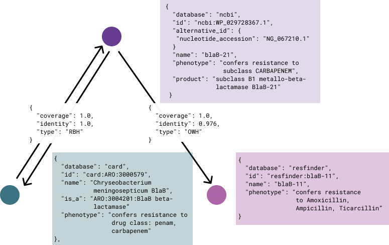

# ChAMReD

## Contributors
[Finlay Maguire](https://github.com/fmaguire)  
[Anthony Underwood](https://gitlab.com/antunderwood)
[Adam Witney](https://gitlab.com/awitney)  
[Alex Manuele](https://gitlab.com/alexmanuele)  
[Inês Mendes](https://gitlab.com/cimendes)  
[Thanh Le Viet](https://gitlab.com/thanhleviet)  
[Trestan Pillonel](https://gitlab.com/tpillone)  
[Varun Shamanna](https://gitlab.com/varunshamanna4)  

## Overview 

This project originated from the dilemma a scientist faces when choosing a database that stores antimicrobial resistance determinants. Multiple databases exist with comparative strengths and weaknesses. This project builds on the concepts of the [haAMRonization](https://github.com/pha4ge/hAMRonization) project aiming to aggeregate and combine the information contained within the metadata associated with each project. The problem is exacerbated by the fact that the equivalent antimicrobial resistance genes (ARGs) can be named differently in each database.

The hypothesis for the project is as follows:  

* Given a match in one database find the matches in other databases and vice versa (reciprocal best hits)
* Aggregate the combined descriptive information pertaining to antimicrobial resistance contained in the union of the metadata
* Report this to user for them to make intelligent informed choices

The tool is split into two parts - a workflow to buld the databases (chamrdb-builder) and this the chamrdb tool itself (this repo) for querying and annotating hAMRonization results.

### Database Builder: chamrdb-builder 
This workflow follows these steps to build the database.

* Download sequences and associated metadata of ARGs from 3 databases
  * [CARD](https://card.mcmaster.ca/) ([Manuscript](http://www.ncbi.nlm.nih.gov/pubmed/31665441))
  * [NCBI AMR Reference Gene Catalog](https://www.ncbi.nlm.nih.gov/pathogens/refgene/)
  * [Resfinder 4](https://bitbucket.org/genomicepidemiology/resfinder/src/4.0/) ([Manuscipt](https://academic.oup.com/jac/article/75/12/3491/5890997))  
* Parse the data to
  * extract the protein sequences and write into fasta format with the gene identifiers as the record ids.
  * extract the associated metadata and convert to a consistent `JSON` format  
* Find best matches of each gene from one source database against the other two target databases using [MMseqs2](https://pubmed.ncbi.nlm.nih.gov/29035372/)
  * Where a reciprocal best hit (RBH) exists, report this.  
  * If a RBH does not exist, report the best match as long as thresholds for coverage and indentity are met.

* From the outputs of the MMseqs2 searches the RBHs or best matches of each gene from one database against the other two databases can be parsed to produce a `Directed Graph` using [networkx](https://networkx.org/).
  In this graph
  * the nodes represent a protein from one database
    * Node attributes contain the phenotype from the JSON metadata
  * the edges link nodes and represent the matches and attributes include
    * type, either RBH or OWH (one way hit)
    * coverage, (alignment length/query length)
    * identity, (percent identity of match)  
  See the image below for a pictoral example using made up data  

\
\


### Installation

You can install directly with pip.

```
git clone https://github.com/maguire-lab/chamred && cd charmed
pip install .
```

### Querying the graph

```
> charmed query --help

usage: chamred query [-h] [-d {card,ncbi,resfinder}] [-ct COVERAGE_THRESHOLD]
                     [-it IDENTITY_THRESHOLD] (-i ID | -f ID_FILE |
                     -j HAMRONIZATION_JSON_FILE) [-o OUTFILE_PATH]

options:
  -h, --help            show this help message and exit
  -d, --database {card,ncbi,resfinder}
                        which database are the gene(s) in
  -ct, --coverage_threshold COVERAGE_THRESHOLD
                        coverage threshold below which a match will not be
                        reported
  -it, --identity_threshold IDENTITY_THRESHOLD
                        identity threshold below which a match will not be
                        reported
  -i, --id ID           The id of a ARG in the specified database
  -f, --id_file ID_FILE
                        Path to a file containing ids of ARGs in the specified
                        database
  -j, --hamronization_json_file HAMRONIZATION_JSON_FILE
                        Path to a hamronization summaty in JSON format
  -o, --outfile_path OUTFILE_PATH
                        Path to file where query results will be written
```

The graph can be queried in one of 3 ways  

#### 1. Querying an individual

Requires specifying the identifier `-i` and database `-d`  

```
chamred query -d ncbi -i WP_012695489.1 
```

Alternatively the gene name can be used

```
chamred query -d ncbi -i qnrB2
```

The output reports the matches and metadata from the other databases  


Another example where the matches are one way hits not RBHs

```
chamred query -d resfinder -i "aac(3)-IIIb"
```

-IIIb.png)
In these outputs ↔ means a RBH, and ➡ a search hit

#### 2. Providing a list of identifiers from a single database

Requires specifying the database `-d`, the text file containing the ids `-f`, and a path for the tsv output file `-o`  

```
grep "^>" chamred/data/db_fastas/card.protein.fasta  | sed 's/>//' > card_ids.txt
chamred query -d card -f card_ids.txt  -o docs/card_vs_ncbi_resfinder.tsv
```
This will produce a [TSV file](/docs/data/card_ids.tsv) containing the matches and associated metadata with one row per id in the text file

#### 3. Use hAMRonization summary output

Use the [hAMRonization softare](https://github.com/pha4ge/hAMRonization) to convert the outputs from antimicrobial resistance gene detection tools into a unified format. Concatenate and summarize AMR detection reports into a single summary JSON file using the `hamronize summarize` command from this package. The JSON output from this step can be used to query ChamreDb.  
Use `-j` to specify the json summary file and `-o` the path for the TSV output  
**Please Note**  
Only outputs using data derived from AMR detection tools that have searched either the `CARD`, `NCBI` or `Resfinder 4` databases can be used.

```
chamred query -j docs/data/hamronize_summary.json -o docs/data/hamronize_summary.tsv
```

This will produce a [TSV file](/docs/data/hamronize_summary.tsv) containing the matches and associated metadata with one row per id in the text file
