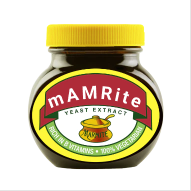
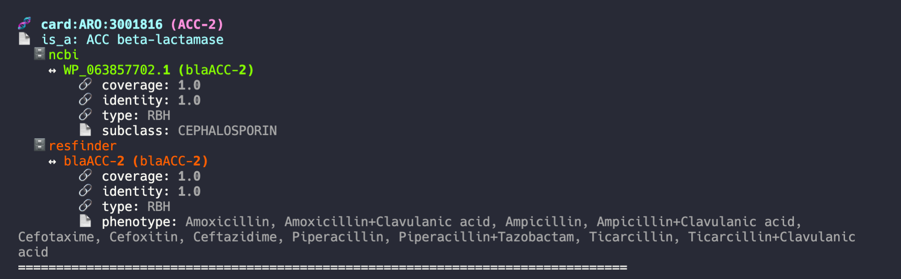

# project mAMRite
  

👆This is a placeholder whilst searching for a better name (the joke may be lost on non-Brits)  

Other potential names include
* AMRinAMR  
  
* CharmeDb  
  


Steps taken so far

## Download data

### CARD
#### Metadata
ARO ontology
```
wget https://github.com/arpcard/aro/raw/master/src/ontology/aro.obo -O db_metadata/card.obo
```
#### Sequence data
##### Protein
```
wget https://card.mcmaster.ca/latest/data -O card_db/data
cd card_db; tar -xvf ./data protein_fasta_protein_homolog_model.fasta
```

##### Nucleotide
```
tar -xvf data ./nucleotide_fasta_protein_homolog_model.fasta
```

### NCBI

#### Metadata
```
wget https://ftp.ncbi.nlm.nih.gov/pathogen/Antimicrobial_resistance/AMRFinderPlus/database/latest/ReferenceGeneCatalog.txt -O db_metadata/ncbi.metadata.tsv
```

#### Sequence data
##### Protein
```
wget https://ftp.ncbi.nlm.nih.gov/pathogen/Antimicrobial_resistance/AMRFinderPlus/database/latest/AMRProt -O db_fastas/ncbi.protein.raw.fasta
```
Nucleotide sequences
```
wget https://ftp.ncbi.nlm.nih.gov/pathogen/Antimicrobial_resistance/AMRFinderPlus/database/latest/AMR_CDS -O db_fastas/ncbi.nucl.raw.fasta
```

### Resfinder

#### Metadata
```
wget https://bitbucket.org/genomicepidemiology/resfinder_db/raw/master/phenotypes.txt -O db_metadata/resfinder.metadata.tsv
```

#### Sequences
```
git clone https://bitbucket.org/genomicepidemiology/resfinder_db
cat resfinder_db/*.fsa > db_fastas/resfinder.nucl.fasta
```

## Parse data

### CARD
Write out protein file with just the CARD ARO ids as fasta headers
[parse_card_proteins.py](scripts/parse_card_proteins.py)


Process the [ARO obo data](db_metadata/card.metadata.obo) to write out `confers_resistance..` and `is_a` metadata to a JSON file where the ARO ids are keys
[parse_card_metadata.py](scripts/parse_card_metadata.py)

### NCBI
Only include those in the core AMR/AMR (acquired) set and remove duplicates with the script. Use the `refseq_protein_accession` as the fasta header
[parse_ncbi_proteins.py](scripts/parse_ncbi_proteins.py)

This produced the output file [ncbi.protein.fasta](db_fastas/ncbi.protein.fasta) with 4542 protein sequences

Metadata JSON file was created using `refseq_protein_accession` as keys and drug subclass as the metadata value
[parse_ncbi_metadata.py](scripts/parse_ncbi_metadata.py)


### Resfinder
Found best ORF from nucleotide and removed duplicated gene/alleles with the script
[resfinder_orfs_to_proteins.py](scripts/resfinder_orfs_to_proteins.py)

This produced the output file [resfinder.protein.fasta](db_fastas/resfinder.protein.fasta) with 2543 protein sequences

Metadata json was created using the [resfinder.metadata.tsv](db_metadata/resfinder.metadata.tsv) as input so that the gene name was the key and phenotype was the metadata value

## Analyse for Reciprocal Best Hits (RBHs)
Used the [MMseqs2](https://github.com/soedinglab/MMseqs2) software that allows very fast protein clustering - see this [publication](https://www.nature.com/articles/s41467-018-04964-5)
Performance characteristics in this [comparison publication](https://bmcgenomics.biomedcentral.com/articles/10.1186/s12864-020-07132-6)

Commands run were
* For each query database (DB1) vs target database (DB2)
  * reciprocal blast hit analysis
    ```
    mmseqs easy-rbh db_fastas/<DB1>.protein.fasta  db_fastas/<DB2>.protein.fasta  results/mmseqs_<DB1>_vs_<DB2>.rbh.tsv tmp -s 7.5
    ```
  * run a search for top 3 hits so that proteins that did not return a RBH have matches to be reported
    ```
    # make database for query DB1
    mmseqs createdb db_fastas/<DB1>.protein.fasta mmseqs_DBs/<DB1>.protein
    mmseqs createindex mmseqs_DBs/<DB1>.protein tmp
    # make database for target DB2
    mmseqs createdb db_fastas/<DB1>.protein.fasta mmseqs_DBs/<DB1>.protein
    mmseqs createindex mmseqs_DBs/<DB1>.protein tmp

    # search DB2 with DB1 to get top 3 hits
    mmseqs search mmseqs_DBs/<DB1>.protein mmseqs_DBs/<DB2>.protein mmseqs_search_DBs/<DB1>_vs_<DB2>_search tmp -s 7.5 --max-accept 3
    mmseqs convertalis  mmseqs_DBs/<DB1>.protein mmseqs_DBs/<DB2>.protein mmseqs_search_DBs/<DB1>_vs_<DB2>_search results/mmseqs_<DB1>_vs_<DB2>.search.tsv
    ```
These commands can be found in [find_rbhs_and_search_matches.sh](scripts/find_rbhs_and_search_matches.sh)

### Summary of RBH analysis

| Comparison | Number of proteins |Number of RBH |
| ----| ---- | ----- |
| CARD vs NCBI |  2979 (CARD)<br>4542 (NCBI) | 2601 (87.3% of CARD proteins) |
| CARD vs Resfinder |  2979 (CARD)<br>2543 (Resfinder) | 2073 (69.6% of CARD proteins) |
| NCBI vs CARD |  4542 (NCBI)<br>2979 (CARD) | 2624 (57.7% of NCBI proteins) |
| NCBI vs Resfinder |  4542 (NCBI)<br>Resfinder (CARD) | 2399 (52.8% of NCBI proteins) |
| Resfinder vs CARD |  2543 (Resfinder)<br>2979 (CARD) | 2096 (82.4% of Resfinder proteins) |
| Resfinder vs NCBI |  2543 (Resfinder)<br>4542 (NCBI) | 2408 (94.7% of Resfinder proteins) |


### Summary of non-RBH searches
After searching the results were filtered to remove RBH hits using the script [build_graph_from_mmseqs_data.py](package/build_graph_from_mmseqs_data.py) (see later for a description)
By combining these non-RBHs with the RBHs the total coverage of each database by another can be determined

| Comparison |Number of proteins that return matches | total proteins covered by RBH and search|
| ----| ---- | ---- |
| CARD vs NCBI | 274 | 2875 (96.5%)|
| CARD vs Resfinder | 739 | 2778 (93.2%)|
| NCBI vs CARD | 1898 | 4542 (99.6%) |
| NCBI vs Resfinder | 2069 | 4495 (99.4%) |
| Resfinder vs CARD | 413 | 2509 (98.6%) |
| Resfinder vs NCBI | 111 | 2519 (99.1%) |


## Building a Networkx graph
Steps include
* Sort and filter RBHs to 
  * sort by query then percent_id match and alignment length
  * remove duplicates (this will keep best match)
  * see the `filter_and_sort_rbhs` function in [hit_functions.py](package/functions/hit_functions.py)
* Filter the non-RBH search matches to find those that do not already have a RBH match
  * get search matches from search that do not have a corresponding accession in the RBH hits
  * sort by query then percent_id match and alignment length
  * see the `filter_and_sort_non_rbhs` function in [hit_functions.py](package/functions/hit_functions.py)
* Make a directed graph (DiGraph) in networkx where
  * the nodes have attributes pulled from the metadata
  * the edges link nodes which have attributes
    * `type` either `RBH` or `OWH` (one way hit) for a search match
    * `coverage` alignment length/query length
    * `identity` percent identity of hit
  * See functions `add_rbh_hits_to_graph` and `add_search_hits_to_graph` in [graph_functions.py](package/functions/graph_functions.py)

These are all combined in the [build_graph_from_mmseqs_data.py](package/build_graph_from_mmseqs_data.py) script

## Querying the graph
The [build_graph_from_mmseqs_data.py](package/build_graph_from_mmseqs_data.py) script writes out the graph in JSON format.

The script [query_graph.py](package/query_graph.py) loads this data and then performs some example queries

### Testing if an edge exists
```
print(G.has_edge('resfinder:blaCMY-1', 'card:ARO:3002012'))
True

```

```
print(G.has_edge('card:ARO:3002012', 'resfinder:blaCMY-1'))
True
```

The more useful function determines the matches in other databases and their associated metadata

e.g

```
graph_functions.print_edge_info('card:ARO:3001816', G)
```



```
graph_functions.print_edge_info('resfinder:aac(3)-IIIb', G)
```

-IIIb.png)

In these outputs ↔ means a RBH, and ➡ a search hit


